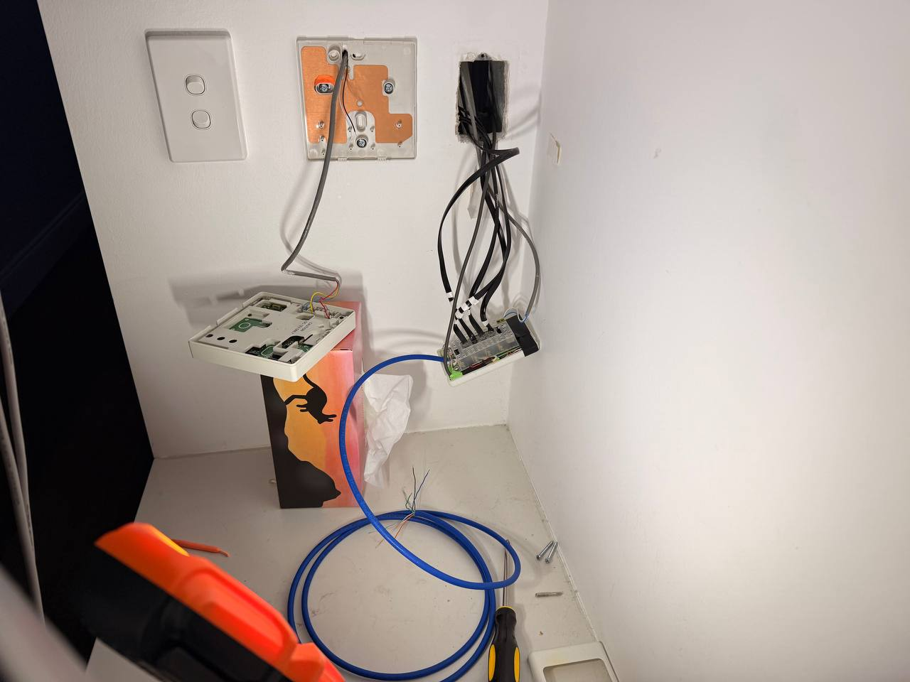

# AC Controller

## Project Summary

This repository hosts the firmware, configuration, and supporting assets for a custom controller box that bridges Fujitsu air conditioners with SmartTemp zoning hardware. The centerpiece of the build is an ESP32-WROOM module mounted on an expansion board and connected to two auxiliary boards populated with solid-state relays (SSRs). One auxiliary board drives the zone dampers, while the other senses their state and houses a piezo speaker for audible acknowledgement of control actions. The controller advertises its capabilities to Home Assistant via an MQTT broker and exposes a lightweight web harness for initial configuration and diagnostics.

## Hardware Overview

### Core Controller

- **ESP32-WROOM DevKit module** seated on a custom expansion board.
- Provides Wi-Fi connectivity, MQTT client functionality, and the application firmware runtime.
- Integrates with the rest of the hardware through the expansion board headers.

### Auxiliary Boards

1. **Control Board**
   - Hosts four SSRs to actuate zone dampers.
   - Includes the LIN driver assembly required to interface with SmartTemp zone equipment.

2. **Sense Board**
   - Hosts four SSRs wired for feedback, allowing the controller to read the live state of zone dampers.
   - Carries the piezo speaker used for audible feedback.

### Additional Components

- **Piezo speaker** for user feedback during command execution or setup.
- **Power regulation and interconnects** handled on the expansion and auxiliary boards.

## Firmware and Features

- **PlatformIO-based project** targeting the ESP32-WROOM module.
- Implements bidirectional control and state sensing for Fujitsu AC units and SmartTemp zone dampers.
- **MQTT integration** allows Home Assistant to discover and command the controller after broker configuration.
- **Web harness** (served from on-device SPIFFS) offers:
  - Initial MQTT setup and device configuration.
  - Quick diagnostics and manual control for troubleshooting.
- **Audio feedback** via the piezo speaker to confirm successful command execution.

## Home Assistant Integration

1. Provision and power up the controller hardware.
2. Configure the controller to connect to your Wi-Fi network.
3. Ensure an MQTT broker is available within Home Assistant (e.g., the built-in Mosquitto broker add-on).
4. Use the on-device web harness to enter MQTT broker credentials and topic settings.
5. Once MQTT is configured, the controller will publish its entities, enabling Home Assistant to control the AC unit and zones.

## Build and Deployment Workflow

1. **Install dependencies**
   - Install [PlatformIO](https://platformio.org/) CLI or the VSCode extension.
   - Ensure Python-based tooling (for helper scripts) is available.

2. **Build the firmware**
   ```bash
   pio run
   ```

3. **Upload firmware and assets**
   - Use PlatformIO upload targets or the provided helper scripts.
   - Refer to `README_OTA_SPIFFS.md` for OTA-specific workflows and SPIFFS handling.

4. **Configure the device**
   - Connect to the controller’s web interface (served from SPIFFS) to enter Wi-Fi and MQTT credentials.
   - Verify Home Assistant autodetects the controller via MQTT discovery.

## Repository Structure

```
├── data/                # Static assets served from SPIFFS (web harness & MQTT setup UI)
├── include/             # Project-wide header files
├── lib/                 # External libraries (placeholder)
├── src/                 # Main firmware source files
│   ├── AC/              # Fujitsu AC-specific logic
│   ├── OTA/             # OTA update implementation and static content bundling
│   └── melody_player/   # Piezo speaker melodies and tone generation
├── visuals/             # Photographs of the hardware build
├── README_OTA_SPIFFS.md # Detailed instructions for OTA and SPIFFS workflows
└── platformio.ini       # PlatformIO project configuration
```

## Visual Reference

Below are a few reference photos from the `visuals/` folder that showcase the prototype, the final enclosure, and how the controller ties into the broader HVAC system.




Additional angles and build stages are available in the rest of the `visuals/` directory for deeper inspection.

## Additional Documentation

- **OTA & SPIFFS Guide:** `README_OTA_SPIFFS.md`
- **PlatformIO Configuration:** `platformio.ini`
- **Helper Scripts:** Shell and Node.js scripts in the project root (e.g., `build_and_upload_spiffs.sh`, `upload_spiffs_ota.js`)

For questions about the firmware, hardware integration, or Home Assistant configuration, consult the source code under `src/` and the supplemental documentation referenced above.
